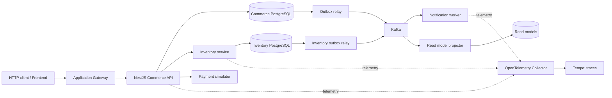

# Lộ trình xây dựng E-Commerce để học Infrastructure & System Design

> Đi từ một ứng dụng NestJS nhỏ đến hệ thống có thể triển khai lặp lại, quan sát, chịu lỗi và khôi phục dữ liệu. Mỗi công nghệ phải gắn với một vấn đề cụ thể và một bài thực hành có thể kiểm chứng.

Ngày biên soạn: **21/09/2026**. Thời lượng gợi ý: **26 tuần, 10–12 giờ/tuần**; đây là khung học, không phải deadline. Trọng tâm là software engineering: kiến trúc ứng dụng, dữ liệu, hệ thống phân tán và nền tảng triển khai bằng code. Khoảng **hai phần ba thời gian** dành cho infrastructure as code, deployment, observability và độ tin cậy của phần mềm.

## 1. Điểm xuất phát và đích đến

### Dự án hiện tại

Đã đối chiếu mã nguồn tại `C:/WORK/PROJECT/e-commerce/`:

- NestJS 11, TypeScript, pnpm; có bộ khung Jest và e2e test.
- `AppModule` chưa có module nghiệp vụ; controller hiện phục vụ endpoint mặc định.
- Chưa thấy cấu hình database, Docker, Kubernetes, Terraform, Helm hay pipeline trong các file dự án đã kiểm tra.
- File `roadmap-microservices-iac.md` có sẵn mô tả WMS/Spring Boot và hạ tầng của một bối cảnh khác. Những mô tả đó không được xem là năng lực hoặc hạ tầng hiện có của dự án này.

**Giả định học tập:** bạn biết TypeScript và REST cơ bản, muốn dùng e-commerce làm môi trường thực hành backend/platform engineering. AWS được chọn làm ví dụ cloud duy nhất để giảm phân tán; có thể thay bằng GCP/Azure, nhưng chỉ học một cloud trong vòng đầu.

### Sau lộ trình, bạn cần tự làm được

1. Thiết kế luồng xử lý từ API qua application service, domain logic, repository và database; xác định ranh giới module và transaction.
2. Viết Dockerfile, Kubernetes manifests, Helm chart và Terraform modules có mục đích rõ ràng.
3. Dựng môi trường mới từ tài liệu và repository; biết thành phần nào cần bootstrap trước.
4. Đưa một phiên bản lên staging, kiểm tra, rollback ứng dụng và xử lý migration tương thích.
5. Từ alert tìm được trace, log và nguyên nhân gây lỗi; chứng minh đã sửa bằng dữ liệu.
6. Xử lý overselling, request trùng, message trùng, consumer chết và payment timeout.
7. Xây một phần nhỏ dùng event sourcing, rebuild read model và giải thích khi nào không nên dùng.
8. Khôi phục database từ backup, đo RPO/RTO và giải thích chi phí vận hành.

## 2. Phạm vi sản phẩm: vừa đủ để tạo bài toán khó

Chỉ xây các luồng sau; dùng Swagger hoặc HTTP client trước khi đầu tư frontend:

| Phần | Chức năng tối thiểu | Bài toán kỹ thuật tạo ra |
| --- | --- | --- |
| Catalog | Danh sách, chi tiết sản phẩm; giá, SKU | Index, pagination, cache, read-heavy traffic |
| Cart | Thêm/xóa sản phẩm, tính tổng tham khảo | State, TTL; giá cuối phải được xác nhận khi checkout |
| Inventory | Tồn kho, giữ hàng, xác nhận xuất, giải phóng giữ hàng | Transaction, concurrency, reservation expiry |
| Order | Tạo đơn, xem trạng thái, hủy đơn | Idempotency, state machine, audit |
| Payment simulator | Thành công, thất bại, chậm, timeout, callback trùng | Retry, reconciliation, saga, side effects |
| Notification worker | Ghi nhận thông báo vào một sink giả lập | Queue, retry, DLQ; không gửi email thật trong lab |

Giữ tiền bằng số nguyên theo đơn vị nhỏ nhất kèm currency. Lưu snapshot tên sản phẩm và đơn giá trong order. Bổ sung authentication đơn giản và kiểm tra quyền sở hữu đơn hàng; không tự xây một identity provider.

**Các invariant phải giữ xuyên suốt:**

- Tồn kho khả dụng không âm; một reservation chỉ được xác nhận hoặc giải phóng một lần.
- Một checkout idempotency key hợp lệ không tạo hai đơn.
- Không ghi nhận hai lần thanh toán cho cùng một payment operation.
- Một đơn chỉ chuyển qua các trạng thái hợp lệ; callback đến muộn không tự hồi sinh đơn đã hủy.
- Lỗi notification không làm mất một order đã commit.

Chưa đưa recommendation, marketplace nhiều người bán, coupon phức tạp hoặc logistics thật vào vòng đầu.

## 3. Thứ tự kiến trúc và công nghệ

### Kiến trúc phát triển qua ba bước

**Bước A — Modular monolith:** một ứng dụng NestJS, các module Catalog/Cart/Order/Inventory/Payment, một PostgreSQL. Module có interface và quyền sở hữu dữ liệu rõ ràng. Đây là nơi học transaction và dựng nền vận hành.

**Bước B — API + worker:** giữ nghiệp vụ chính trong monolith, thêm outbox relay và notification worker chạy độc lập. Học async processing, retry và scaling mà chưa phân tán toàn bộ dữ liệu.

**Bước C — Tách Inventory có chủ đích:** Inventory có process, credentials và database riêng; Order phối hợp bằng saga. Trong lab có thể dùng chung một PostgreSQL server nhưng database/user tách biệt, không truy cập bảng của nhau. Đó chưa phải cách ly failure domain như hai database server độc lập.



Sơ đồ là đích học tập, không phải số lượng thành phần cần cài từ ngày đầu. Metrics và logs được bổ sung theo luồng riêng ở giai đoạn observability.

### Bộ công nghệ mặc định

| Lớp | Lựa chọn | Khi đưa vào |
| --- | --- | --- |
| Application | NestJS + PostgreSQL; chọn một ORM và dùng migrations | Tuần 2 |
| Local runtime | Docker Compose; Windows có thể dùng WSL2 | Tuần 4 |
| Telemetry | OpenTelemetry, Prometheus, Grafana, Tempo, Loki, Alloy | Tuần 5–6, thêm dần |
| Kubernetes local | kind; Minikube là phương án thay thế | Tuần 7 |
| Packaging | Helm chart tự viết cho application | Tuần 10 |
| Cloud provisioning | Terraform; AWS ECR, EKS, RDS, S3, IAM | Tuần 12–14 |
| Delivery | GitHub Actions + Argo CD | Tuần 15–16 |
| Messaging | Kafka ở chế độ KRaft; một broker chỉ dành cho lab | Tuần 17 |
| Cache | Redis cache-aside cho Catalog | Tuần 22, khi có số liệu |
| Load/failure testing | k6, script gây lỗi có kiểm soát | Từ tuần 3, tăng dần |

Không cài tất cả cùng lúc. Tách Compose profiles cho app/data, telemetry và messaging. Nếu máy thiếu tài nguyên, chạy từng lab, rút ngắn retention và tắt stack không dùng. Chốt phiên bản tương thích trong repository; tránh tag `latest`.

### Phân biệt các công cụ dễ bị nhầm vai trò

| Công cụ/khái niệm | Trách nhiệm trong dự án |
| --- | --- |
| Terraform | Provision IAM, cluster, database, storage và registry; quản lý state của hạ tầng |
| Kubernetes | Reconcile trạng thái workload, scheduling, discovery và lifecycle |
| Helm | Đóng gói và render Kubernetes resources từ values |
| Argo CD | Kéo desired state từ Git và reconcile application vào cluster |
| CI | Kiểm tra, build, scan và xuất bản artifact; đề xuất phiên bản triển khai |
| Observability | Cung cấp bằng chứng để hiểu trạng thái và nguyên nhân của hệ thống |

Chỉ một công cụ sở hữu lifecycle của mỗi resource. Ví dụ: Terraform tạo EKS; bước bootstrap cài Argo CD; Argo CD quản lý application charts. Không để Terraform Helm provider và Argo CD cùng quản lý một release.

## 4. Bản đồ 26 tuần

| Giai đoạn | Tuần | Trọng tâm | Sản phẩm kiểm chứng |
| --- | --- | --- | --- |
| 0 | 1 | Kiến trúc NestJS, module boundary, thiết kế nghiệp vụ | Sơ đồ module, checkout sequence, ADR đầu tiên |
| 1 | 2–3 | E-commerce tối thiểu, SQL correctness | Checkout chống trùng và overselling |
| 2 | 4 | Docker, local environment, CI cơ bản | Clone sạch chạy được bằng hướng dẫn |
| 3 | 5–6 | Observability nền tảng | Tìm được lỗi từ trace/metrics/logs |
| 4 | 7–9 | Kubernetes và runtime | Rolling update, probes, resource control |
| 5 | 10–11 | Helm | Chart có validation, install/upgrade/rollback |
| 6 | 12–14 | Terraform và cloud | Provision có state/locking; cloud lab nếu có ngân sách |
| 7 | 15–16 | CI/CD, GitOps, migration | Một artifact qua staging; rollback có kiểm chứng |
| 8 | 17–19 | Events, outbox, microservices, saga | Crash/retry không làm sai nghiệp vụ |
| 9 | 20–21 | CQRS và event sourcing | Rebuild Order read model từ event store |
| 10 | 22–23 | Performance, SLO, autoscaling | Báo cáo tải và dashboard saturation |
| 11 | 24–26 | Security, DR, vận hành tổng hợp | Restore drill, game day, portfolio kỹ thuật |

Nếu chỉ có 5–6 giờ/tuần, kéo dài tương ứng. Có thể đi nhanh qua phần đã biết bằng cách hoàn thành bài kiểm chứng; không chỉ đánh dấu vì đã xem tutorial.

## 5. Giai đoạn 0 — Thiết kế phần mềm và tổ chức NestJS

**Học:** NestJS modules, dependency injection, provider scope, request lifecycle; separation of concerns, dependency inversion và ranh giới nghiệp vụ. Phân biệt DTO dùng ở API, entity/domain model và persistence model; chỉ tách thành nhiều model khi có nhu cầu rõ ràng.

**Thực hành:**

- Dựa trên cấu trúc `src/modules/` đã tạo, xác định trách nhiệm của Catalog, Cart, Inventory, Orders, Payments và Notifications.
- Vẽ luồng `controller → application service → domain logic → repository`; ghi rõ validation, business rule và transaction nằm ở đâu.
- Thiết kế interface giữa các module; dùng provider exports có chủ đích, tránh circular dependency và truy cập thẳng repository của module khác.
- Vẽ sequence checkout gồm luồng thành công, hết hàng và thanh toán thất bại; giai đoạn này chỉ cần thiết kế, chưa triển khai saga.
- Viết `docs/architecture.md`: chức năng, invariant, dependencies, dữ liệu cần lưu.
- Viết ADR-001: vì sao bắt đầu bằng modular monolith; tín hiệu nào sẽ khiến bạn tách service.
- Lập workload giả định: catalog đọc nhiều, checkout ghi ít hơn nhưng đòi hỏi correctness; flash sale tập trung vào cùng một SKU.

**Xong khi:** chỉ ra được module sở hữu từng dữ liệu, business rule cần bảo vệ và điểm bắt đầu/kết thúc transaction. Có thể mô tả cách kiểm thử nghiệp vụ mà không cần dựng toàn bộ ứng dụng.

## 6. Giai đoạn 1 — Một checkout đúng để đem đi vận hành

**Học:** module boundary, state machine, ACID, isolation, index, unique constraint, optimistic/pessimistic concurrency và idempotency.

**Thực hành:**

- Tạo modules Catalog, Inventory, Orders và Payment simulator. Cart có thể rất đơn giản.
- Viết database migration và seed; endpoint tạo đơn, xem đơn, xác nhận/hủy đơn.
- Đặt `Idempotency-Key` cho checkout, scope theo người dùng và operation. Lưu request hash; cùng key nhưng payload khác phải bị từ chối. Xử lý cả hai request đồng thời, không chỉ request gửi tuần tự.
- Ghi rõ trạng thái key đang xử lý, đã hoàn thành và thời hạn giữ kết quả.
- Giữ hàng bằng cập nhật có điều kiện hoặc row lock trong transaction. Lưu reservation và biến động tồn kho trong cùng transaction.
- Với nhiều SKU, khóa theo thứ tự ổn định để giảm deadlock; retry có giới hạn cho lỗi transaction phù hợp.
- Dùng reservation expiry worker; bảo đảm tranh chấp giữa expiry và payment confirmation không giải phóng/trừ hàng hai lần.
- Bảo vệ endpoint xem đơn bằng quyền sở hữu; validate input; dùng cơ chế lưu mật khẩu an toàn nếu có password login.

**Bài kiểm chứng:** seed tồn kho 10, cho 100 request đồng thời giữ mỗi request 1 sản phẩm. Chỉ tối đa 10 reservation thành công, tồn kho không âm. Gửi lại cùng checkout key không tăng số order.

**Tự hỏi:** index giúp truy vấn nào? Deadlock khác race condition ra sao? Vì sao cache hoặc một distributed lock không tự thay thế invariant trong database?

Đọc cơ chế khóa trực tiếp trong [PostgreSQL — Explicit Locking](https://www.postgresql.org/docs/current/explicit-locking.html). Thiết kế transaction và bài kiểm chứng ở trên là bài tập đề xuất cho dự án.

## 7. Giai đoạn 2 — Đóng gói và chạy lại được

**Học:** image layers, build context, multi-stage build, runtime configuration, non-root user, persistent volumes và graceful shutdown.

**Thực hành:**

- Viết Dockerfile build NestJS và stage runtime chỉ giữ dependency cần thiết; cố định runtime version phù hợp.
- Viết `.dockerignore`, `.env.example`, Compose app + PostgreSQL, healthchecks và named volume.
- Chạy migration bằng bước riêng có thể quan sát kết quả. Không để mọi replica tự chạy migration khi khởi động.
- Xử lý SIGTERM: ngừng nhận request mới, hoàn tất request đang xử lý trong deadline, đóng DB pool.
- App có startup retry/backoff hữu hạn khi dependency chưa sẵn sàng. Thứ tự khởi động không giải quyết mọi lỗi dependency về sau.
- CI đầu tiên: install với lockfile, lint, test, build. Không chờ đến giai đoạn GitOps mới có CI.

**Xong khi:** một người khác có thể chạy dự án từ clone sạch và cấu hình mẫu; restart container không mất dữ liệu; tắt app khi có request không gây lỗi khó giải thích.

**Deliverables:** Dockerfile, Compose, tài liệu setup và pipeline cơ bản. Tài liệu phải phân biệt reset app với xóa volume dữ liệu.

## 8. Giai đoạn 3 — Quan sát được trước khi phân tán

**Học:** metrics, logs, traces; RED (rate/errors/duration), saturation; histogram, percentile, cardinality, context propagation và sampling.

**Lắp từng phần theo thứ tự:**

1. JSON logs với timestamp, level, service, environment, request/trace ID; che token và dữ liệu nhạy cảm.
2. Prometheus scrape metrics của app; Grafana hiển thị HTTP throughput, error ratio, p95/p99, DB pool, Node.js event-loop lag.
3. OpenTelemetry SDK gửi traces qua Collector tới Tempo. Khởi tạo instrumentation trước các thư viện cần instrument.
4. Alloy thu container logs tới Loki; liên kết log với trace ID trong Grafana.

Collector nhận/xử lý/xuất telemetry; nó không phải nơi lưu trữ và truy vấn dài hạn. Xem [OpenTelemetry Collector](https://opentelemetry.io/docs/collector/). Dự án mới dùng Alloy cho luồng logs: [Grafana xác nhận Promtail đã EOL từ 02/03/2026](https://grafana.com/docs/loki/latest/send-data/promtail/).

**Thực hành:**

- Dashboard business: order được tạo/xác nhận/hủy, payment thất bại, reservation hết hạn.
- Dashboard runtime: latency theo route template, errors, CPU, memory, event-loop lag, connection pool.
- Không dùng `orderId`, `userId`, raw URL làm metric label; giữ chúng trong logs/traces khi phù hợp.
- Cố ý làm một truy vấn chậm và một payment call chậm. Tìm dependency chậm nhất từ trace.
- Tạo một alert có runbook: lỗi checkout tăng → mở dashboard → xem trace → kiểm tra pool/database.
- Đặt giới hạn retention và sampling cho lab; thử cho telemetry backend ngừng hoạt động và kiểm tra app không bị treo theo.

**Xong khi:** lấy một request lỗi bất kỳ, đi từ metric đến trace rồi log liên quan; giải thích được thời gian bị tiêu tốn ở đâu. Commit dashboard và alert rules vào Git.

## 9. Giai đoạn 4 — Kubernetes thực chất

Không cần có microservices mới học Kubernetes. Triển khai monolith có database và telemetry đã đủ tạo nhiều bài toán runtime.

**Học và thực hành theo thứ tự:**

| Chủ đề | Bài thực hành |
| --- | --- |
| Control plane, reconciliation, scheduler | Xóa một Pod và giải thích Deployment tạo lại nó |
| Deployment, ReplicaSet, Service | Chạy 2 replica và kiểm tra ứng dụng xử lý request qua Service |
| ConfigMap, Secret, ServiceAccount | Đưa config ra ngoài image; cấp quyền tối thiểu |
| Probes | Tách `/health/live`, `/health/ready`; thêm startup probe khi cần |
| Requests/limits, QoS | Gây CPU throttling và OOMKill; tìm bằng events/metrics |
| PVC, StorageClass, StatefulSet | Persist PostgreSQL của lab; restart và kiểm tra dữ liệu |
| Workload access policy | Giới hạn quyền giao tiếp theo dependency của ứng dụng bằng NetworkPolicy |
| Gateway API | Cấu hình Gateway/HTTPRoute để publish API trên controller đã cài |
| Rolling update, termination | Update khi có tải; drain request trong grace period |
| Disruptions | Thử drain node; hiểu PDB và topology spread |

Readiness quyết định Pod có nhận traffic qua Service; liveness phát hiện tình trạng cần restart container; startup probe bảo vệ quá trình khởi động. Không gắn liveness trực tiếp vào việc database đang sống để tránh restart hàng loạt khi DB lỗi. Tham khảo [Kubernetes — Probes](https://kubernetes.io/docs/concepts/workloads/pods/probes/).

**Những điều phải kiểm chứng thay vì chỉ viết YAML:**

- CNI của cluster local có thực thi NetworkPolicy hay không; nếu không, dùng cấu hình/CNI có hỗ trợ để làm lab này.
- Gateway API cần CRDs và controller implementation; khai báo `HTTPRoute` một mình không tạo proxy. Đọc [Gateway API](https://kubernetes.io/docs/concepts/services-networking/gateway/).
- PVC/StatefulSet không tự cung cấp backup, database replication hoặc HA.
- PDB chủ yếu giới hạn voluntary eviction; không ngăn mọi lỗi node và không thay thế chiến lược rolling update.
- Hai Pod trên cùng một node chưa tạo khả năng chịu lỗi mất node. Multi-node kind trên cùng laptop cũng không mô phỏng đầy đủ failure domain cloud.
- Kubernetes Secret dùng base64 không đồng nghĩa với mã hóa dữ liệu; kiểm soát RBAC và encryption at rest riêng.

**Xong khi:** tự chẩn đoán được `Pending`, `ImagePullBackOff`, `CrashLoopBackOff`, readiness fail và OOMKill bằng `describe`, events, logs và metrics. Có báo cáo rolling update dưới tải.

## 10. Giai đoạn 5 — Tự viết Helm chart có thể bảo trì

**Mục tiêu:** hiểu chart của ứng dụng mình; dùng chart có sẵn và pin version cho thành phần hạ tầng phức tạp.

**Chart application cần có:**

- `Chart.yaml`, `values.yaml`, `values.schema.json` và `_helpers.tpl`.
- Deployment, Service, ConfigMap, ServiceAccount; tham chiếu Secret đã được cung cấp.
- Requests/limits, probes, security context, annotations, scheduling và image digest.
- Gateway route bật/tắt qua values; HPA và PDB tùy chọn khi đã đủ điều kiện.
- `values-local.yaml`, `values-staging.yaml`; file mẫu production chỉ là thiết kế, chưa chứng minh production readiness.
- NOTES hoặc README ghi prerequisites, port, cách cấu hình secrets, nâng cấp và rollback.

**Bài thực hành:**

1. Chuyển manifests đã hiểu ở giai đoạn 4 sang templates; tránh template hóa mọi trường khi chưa cần.
2. Render cả local và staging, lint rồi validate manifest với Kubernetes version/CRD schema tương ứng.
3. Cài vào namespace sạch, chạy smoke test endpoint và readiness.
4. Upgrade image/config rồi cố ý dùng image sai để xem rollout fail.
5. Rollback release và kiểm tra lại hành vi ứng dụng.

Các lệnh định hướng, chạy sau khi đã tạo chart và chuẩn bị cluster:

```bash
helm lint deploy/helm/commerce -f deploy/helm/commerce/values-local.yaml
helm template commerce deploy/helm/commerce -f deploy/helm/commerce/values-local.yaml
helm upgrade --install commerce deploy/helm/commerce --namespace commerce --create-namespace -f deploy/helm/commerce/values-local.yaml --wait --timeout 5m
```

**Xong khi:** deploy được cùng chart vào hai namespace bằng values khác nhau, values sai bị phát hiện sớm và rollback ứng dụng thành công. Helm rollback không tự hoàn tác database migration.

Tài liệu: [Helm — Chart Best Practices](https://helm.sh/docs/chart_best_practices/). Luôn đối chiếu CLI flags với phiên bản Helm đã pin.

## 11. Giai đoạn 6 — Terraform và hạ tầng cloud

### 6.1. Kiến thức cần hiểu

HCL, providers, resources/data sources, variables/outputs/locals, dependency graph, modules, state, drift, import, plan/apply và lifecycle. Phân biệt cấu hình mong muốn, state đang theo dõi và resource thực ngoài cloud.

**Bài tập theo độ khó:**

1. Viết một root module nhỏ; chạy `fmt`, `init`, `validate`; đọc plan trước khi apply.
2. Provision một nhóm resource lab nhỏ như bucket riêng và IAM tối thiểu, nếu có cloud account/ngân sách.
3. Tách module theo trách nhiệm đã rõ: registry, database, Kubernetes, workload identity. Không tạo module chỉ để bọc từng resource một cách máy móc.
4. Sửa một thuộc tính thủ công trong cloud sandbox, chạy plan và xử lý drift có chủ đích.
5. Thực hành import resource lab có sẵn; dùng moved block khi refactor địa chỉ resource để tránh tái tạo không cần thiết.

### 6.2. Thiết kế AWS tham chiếu

- Dùng cấu hình kết nối cloud có sẵn hoặc module nền tảng được duy trì; truyền các ID cần thiết vào module triển khai ứng dụng. Phần học tập trung vào resource lifecycle, inputs/outputs, dependency và permissions.
- ECR chứa image; EKS chạy ứng dụng; RDS PostgreSQL cho cloud lab.
- Database không public; security groups chỉ mở từ workload được phép.
- IAM cho người vận hành, CI và workload tách biệt. Dùng workload identity phù hợp thay vì nhét access key vào Pod.
- S3 phục vụ state/backup theo bucket và policy riêng; quản lý encryption và retention.
- Vẽ dependency graph giữa application, registry, cluster, database và storage; xác định thành phần nào được tạo, cập nhật hoặc thay thế trong mỗi plan.

Tự viết một module nhỏ như registry hoặc storage để hiểu inputs/outputs. Với EKS, có thể dùng module được duy trì sau khi đọc tài nguyên, quyền và defaults mà nó tạo; không cần tự viết toàn bộ EKS module ngay vòng đầu.

### 6.3. State và vòng đời môi trường

- Tách root/state của bootstrap, platform và data khi có lý do về lifecycle hoặc blast radius; không tách cực nhỏ ngay từ đầu.
- Dùng backend remote có encryption, versioning, access control và locking. Bảo vệ cả saved plan và CI artifacts có thể chứa secrets.
- Với S3 backend hỗ trợ hiện tại, bật `use_lockfile = true`; DynamoDB-based locking đã deprecated. Xem [Terraform — S3 Backend](https://developer.hashicorp.com/terraform/language/backend/s3).
- Bootstrap bucket backend trước; lưu và bảo vệ state bootstrap, rồi chuyển sang backend theo quy trình được ghi lại. Không tạo vòng phụ thuộc bucket chứa chính state mà chưa có bootstrap.
- `sensitive = true` chủ yếu che output; giá trị vẫn có thể nằm trong state/plan. Xem [Terraform — Manage Sensitive Data](https://developer.hashicorp.com/terraform/language/manage-sensitive-data).
- Commit provider dependency lockfile `.terraform.lock.hcl`; không commit state, credentials hoặc saved plan có dữ liệu nhạy cảm.
- Dùng root/backend và quyền riêng cho staging/production. Terraform workspace đơn thuần không tự tạo ranh giới bảo mật.
- CI dùng `fmt -check`, `validate`, lint/security scan; plan cần đúng credentials/context. Validation không chứng minh cloud triển khai được.

### 6.4. Ngân sách và nhánh không dùng cloud

Trước cloud lab, lập dự toán theo region và thời lượng cho cluster, nodes, database, storage, snapshots, telemetry và các dịch vụ phụ trợ do module cloud tạo ra; đặt budget alert. Không giả định free tier bao phủ thiết kế này. Tham khảo [AWS EKS — Cost Optimization](https://docs.aws.amazon.com/eks/latest/best-practices/cost-opt.html).

Chạy lab theo phiên, có inventory tài nguyên và teardown checklist. Tách dữ liệu cần giữ khỏi tài nguyên thử nghiệm; kiểm tra các volume, snapshot và load balancer còn sót sau teardown. Budget alert không phải công tắc chặn chi phí cứng.

**Nếu chưa dùng cloud:** tiếp tục kind + Helm, luyện HCL bằng provider local/Docker và static checks cho module AWS. Đánh dấu rõ “chưa kiểm chứng trên cloud”; simulator/local provider không chứng minh IAM, managed database hay EKS hoạt động thật.

**Xong khi:** với nhánh cloud, dựng lại sandbox từ Terraform và bootstrap được cluster; apply lần hai không có thay đổi bất ngờ, chứng minh được state locking. Với nhánh local, hoàn tất bài HCL và ghi rõ cloud milestone còn mở.

## 12. Giai đoạn 7 — CI/CD, GitOps và deployment an toàn

**Luồng đích:**

```text
Pull request → lint/test/build → image scan + SBOM → push image theo digest
             → cập nhật manifest/version trong Git
             → Argo CD sync staging → migration có kiểm soát → smoke test
             → quan sát metrics → promote cùng digest sang môi trường tiếp theo
```

Thứ tự migration và rollout cụ thể phụ thuộc thay đổi schema; dùng expand-contract bên dưới để giữ tương thích.

**Thực hành:**

- Unit test invariant; integration test với PostgreSQL thật trong môi trường test; e2e checkout/idempotency.
- Build một image rồi promote chính digest đó; không rebuild cho từng môi trường.
- GitHub Actions dùng OIDC để nhận cloud credentials ngắn hạn; giới hạn trust theo repository, branch/environment. Xem [GitHub Actions — OpenID Connect](https://docs.github.com/en/actions/concepts/security/openid-connect).
- Argo CD kéo desired state từ Git; phân quyền repository và destination namespace. Tìm hiểu sync, health, prune và drift ở [Argo CD Documentation](https://argo-cd.readthedocs.io/en/stable/).
- Chọn một owner cho migration: CI job hoặc GitOps job với sequencing rõ; xử lý khóa, retry, timeout và log. Không chạy migration cạnh tranh từ mọi Pod.
- Hosted CI runner không mặc nhiên truy cập kind trên laptop. Dùng cluster tạm ngay trong runner để test chart, hoặc Argo CD trên cluster local kéo Git/registry có thể truy cập.
- Khi GitOps đã quản lý deployment, rollback bằng revert desired state trong Git rồi reconcile. Thay đổi trực tiếp bằng Helm/kubectl có thể bị Argo CD ghi đè.

**Lab expand-contract:** thêm cột mới tương thích → deploy code đọc/ghi tương thích hai phiên bản → backfill theo batch → chuyển hoàn toàn → chỉ xóa cột cũ ở release sau khi hết nhu cầu rollback. Đo lock duration; migration không chỉ là “SQL chạy thành công”.

**Xong khi:** từ commit đến staging truy vết được image digest và revision; cố ý deploy lỗi rồi revert; ứng dụng cũ vẫn chạy được với schema đã expand. Có ghi chú trường hợp buộc phải roll forward.

## 13. Giai đoạn 8 — Event-driven, outbox và saga

### 8.1. Phân biệt trước khi triển khai

| Khái niệm | Ý nghĩa | Ví dụ |
| --- | --- | --- |
| Event-driven | Thành phần phản ứng với sự kiện | `OrderConfirmed` kích hoạt notification |
| CQRS | Tách mô hình/luồng command và query | Ghi order qua command, đọc danh sách qua read model |
| Event sourcing | Chuỗi event là dữ liệu gốc của aggregate | Khôi phục Order từ các event đã lưu |
| Outbox | Ghi ý định phát event cùng transaction nghiệp vụ | Order và outbox record commit cùng nhau |
| Saga | Phối hợp nhiều local transaction với bước bù | Giữ hàng → thanh toán → xác nhận hoặc giải phóng |

Có Kafka không có nghĩa là đã dùng event sourcing. Có CQRS không bắt buộc phải có event store. Audit log cũng chưa đủ nếu trạng thái nghiệp vụ không được quyết định từ event history.

### 8.2. Bắt đầu bằng một consumer độc lập

Học topic, partition, key, consumer group, offset, lag, retention, ordering, at-least-once và backpressure. Dùng key `orderId` khi cần giữ thứ tự event của một order; không giả định thứ tự toàn cục.

**Lab outbox:**

1. Commit order và outbox record trong cùng transaction PostgreSQL.
2. Relay publish rồi đánh dấu đã gửi; thử kill relay giữa hai bước để tạo duplicate có chủ đích.
3. Consumer dùng bảng inbox/dedup với unique key theo consumer và event ID; ghi dedup và business change trong cùng local transaction.
4. Chỉ commit offset sau khi xử lý bền vững. Gửi lại event không làm tăng số thông báo giả lập.

Outbox relay có thể phát trùng, nên consumer cần idempotency. Tham khảo [Transactional Outbox — Chris Richardson](https://microservices.io/patterns/data/transactional-outbox.html).

**Bổ sung:** retry có backoff/jitter và giới hạn; phân loại lỗi tạm thời với payload không hợp lệ; DLQ kèm công cụ kiểm tra/redrive. Khi retry song song, chứng minh không làm đảo thứ tự state transition của cùng order. Với relay nhiều instance, thiết kế claim/lease và ordering theo aggregate; `SKIP LOCKED` một mình không chứng minh thứ tự publish.

Event envelope gồm `eventId`, `eventType`, `schemaVersion`, `aggregateId`, `aggregateVersion`, `occurredAt`, `correlationId`, `causationId` và trace context. Kiểm tra schema compatibility trong CI khi thay đổi contract.

Kafka transactions/exactly-once có phạm vi bảo đảm cụ thể; không tự khiến HTTP payment hay cập nhật database bên ngoài xảy ra đúng một lần. Đọc phần delivery semantics trong [Apache Kafka — Design](https://kafka.apache.org/41/design/design/).

### 8.3. Tách Inventory để học giao dịch phân tán

Sau khi outbox/worker ổn, tách Inventory theo ranh giới đã có. Order không còn truy cập trực tiếp bảng Inventory. Viết ADR ghi lợi ích học tập, chi phí network và dữ liệu không còn transaction chung.

Thiết kế checkout saga có trạng thái lưu bền vững:

```text
OrderPending → ReserveInventory → RequestPayment → ConfirmOrder
                    ↓ thất bại          ↓ thất bại xác định
                 RejectOrder       ReleaseInventory → CancelOrder
```

- Chọn orchestration trong vòng đầu để dễ nhìn tiến độ; ghi command/result và deadline bền vững.
- Mỗi bước và bước bù phải idempotent, có thể chạy lại sau process restart.
- Payment timeout là **chưa biết kết quả**; query/reconcile theo payment operation ID trước khi quyết định thu lại hoặc hủy.
- Payment đã thành công nhưng confirm order thất bại: retry confirm hoặc đi vào quy trình refund/compensation rõ ràng.
- Reservation hết hạn đồng thời payment thành công: có policy xử lý, state transition có kiểm soát và hàng đợi reconciliation.
- Compensation thất bại cũng cần retry và trạng thái chờ xử lý; không giả định bước bù luôn thành công.

Saga dùng các local transaction và hành động bù; không có rollback/isolation tự động như một transaction database chung. Tham khảo [Saga — Chris Richardson](https://microservices.io/patterns/data/saga.html).

**Xong khi:** payment chậm, worker chết, duplicate và callback muộn đều có kết quả nghiệp vụ giải thích được; không mất đơn đã commit, không thu tiền hai lần, reservation không bị treo vô hạn.

## 14. Giai đoạn 9 — Event sourcing và CQRS bằng một phạm vi nhỏ

**Phạm vi:** áp dụng cho aggregate `Order` trong lab/nhánh phát triển riêng rồi tích hợp có kiểm chứng. Catalog tiếp tục CRUD. Không chuyển toàn hệ thống chỉ để dùng cùng một pattern.

Event sourcing có giá trị khi lịch sử thay đổi và tái dựng trạng thái là nhu cầu thực; đổi lại cần xử lý concurrency, evolution và replay. Đọc [Microsoft — Event Sourcing Pattern](https://learn.microsoft.com/en-us/azure/architecture/patterns/event-sourcing).

### Mô hình tối thiểu

```text
Command: ConfirmOrder(orderId, expectedVersion, commandId)
  → đọc event stream → dựng Order → kiểm tra invariant
  → append event ở version tiếp theo → commit

Event stream: OrderPlaced → InventoryReserved → PaymentRecorded → OrderConfirmed
  → projector → order_summary / order_timeline
```

Các event trong stream phản ánh sự thật Order đã chấp nhận; phải phân biệt với integration event nhận từ service khác. Có thể ánh xạ domain event sang integration event để tránh lộ mô hình nội bộ.

**Thực hành theo thứ tự:**

1. PostgreSQL event table: `event_id`, `aggregate_id`, `version`, `type`, `schema_version`, `payload`, `metadata`, `occurred_at`; unique `(aggregate_id, version)`.
2. `load(stream)` dựng trạng thái; `decide(command)` kiểm tra invariant; `apply(event)` cập nhật state thuần, không gọi dịch vụ bên ngoài.
3. Append với expected version; conflict thì reload và quyết định lại có giới hạn. Dedupe command để retry không sinh event nghiệp vụ trùng.
4. Ghi event và outbox trong cùng database transaction khi cần publish ra broker; không dual-write event store và Kafka rồi hy vọng cả hai thành công.
5. Projector tạo `order_summary`, lưu checkpoint/dedup cùng cập nhật read model; xử lý crash và event đến lại.
6. Replay theo thứ tự bền vững trong từng stream. Nếu quét nhiều stream, chọn cơ chế cursor/commit ordering không bỏ sót transaction commit muộn; không coi timestamp hoặc sequence được cấp trước commit là bằng chứng đủ.
7. Ghi rõ eventual consistency: command đã thành công nhưng query projection có thể chậm. Trả version/token để client biết tiến độ hoặc đọc lại sau; đo projection lag.
8. Khi replay, tắt side effects bên ngoài: không thu tiền, gửi notification hoặc phát lại integration events một cách vô thức.
9. Thay schema một event rồi đọc được cả lịch sử cũ bằng versioned handler/upcaster. Thêm snapshot khi có số đo replay chậm; snapshot là tối ưu, event stream vẫn là nguồn dữ liệu gốc.
10. Hạn chế PII trong immutable events; lưu tham chiếu tới dữ liệu cá nhân có lifecycle riêng, xác định retention/quyền truy cập từ thiết kế.

**Bài kiểm chứng bắt buộc:**

- Xóa riêng read model trong database lab, rebuild từ event store và so sánh với expected state của bộ dữ liệu cố định.
- Chạy replay lần hai cho cùng input: kết quả giống lần đầu, không tăng số payment/notification operations.
- Hai command cùng expected version: không có hai event cùng stream version; invariant vẫn đúng sau xử lý conflict.
- Consumer crash giữa xử lý và checkpoint không làm projection sai khi chạy lại.

**Quyết định cuối giai đoạn:** viết ADR giữ hoặc loại event sourcing khỏi bản tích hợp dựa trên lợi ích và chi phí đã đo. Bài học vẫn hoàn thành nếu kết luận CRUD + audit history phù hợp hơn cho một phần nghiệp vụ.

## 15. Giai đoạn 10 — Capacity, SLO và autoscaling

### Thiết kế theo số đo

Học throughput, latency, concurrency, utilization, queueing, hotspot, bottleneck và connection budget. Ước lượng ban đầu `concurrency ≈ throughput × average latency` với đơn vị nhất quán, rồi đối chiếu phép đo; không thay average bằng p99 trong công thức này.

**Workload lab đề xuất:** 10.000 products, 100.000 historical orders, traffic đọc/ghi 90/10, có cả request phân tán và flash sale cùng SKU. Bắt đầu tải thấp, tăng theo bậc; ghi máy, dataset, replica, DB pool, warmup, duration và commit cho từng lần đo.

**Bài thực hành:**

- k6 baseline → load → spike → soak; so sánh trước/sau một thay đổi mỗi lần.
- Dùng query plan và DB metrics trước khi thêm cache.
- Redis cache-aside cho Catalog: TTL có jitter, invalidation sau cập nhật, cache stampede và hành vi khi Redis chết. Checkout vẫn xác nhận giá/tồn kho ở nguồn dữ liệu có thẩm quyền.
- HPA cho API với metrics-server và resource requests phù hợp; phân biệt HPA tăng Pod với node autoscaling tăng capacity.
- Kiểm tra `max replicas × DB pool per replica` nằm trong connection budget; nhiều Pod hơn có thể làm DB quá tải nhanh hơn.
- Scale consumer theo lag có giới hạn; trong mô hình consumer group thông thường, số partition giới hạn consumer có thể xử lý song song hữu ích. Partition hot vẫn có thể nghẽn dù tổng CPU thấp.
- Deadline, retry budget, circuit breaker, bulkhead, rate limit và load shedding; tránh mọi tầng đều retry một lỗi thành retry storm.

### SLO phải đo trải nghiệm và kết quả nghiệp vụ

Ví dụ khởi điểm để hiệu chỉnh theo baseline, **không phải cam kết năng lực của hệ thống**:

| SLI | Định nghĩa trong lab | SLO thử nghiệm |
| --- | --- | --- |
| Checkout availability | Request hợp lệ được nhận/xử lý không lỗi hệ thống / tổng request hợp lệ; out-of-stock là kết quả nghiệp vụ riêng | 99,5% trong cửa sổ 7 ngày khi môi trường chạy liên tục |
| Catalog latency | Tỷ lệ request catalog hợp lệ trả thành công dưới 300 ms tại tải đã công bố | 95% |
| Saga completion | Checkout được nhận đạt terminal state trong 30 giây / tổng checkout được nhận | 99%; theo dõi riêng success/rejection |
| Projection freshness | Event được phản ánh vào read model dưới 5 giây / tổng event cần project | 99% |

HTTP `202 Accepted` không chứng minh saga đã xong; theo dõi cả tuổi của workflow còn pending. Overselling và duplicate payment là invariant cần phát hiện ngay, không phải lỗi được cho phép bởi error budget.

Học error budget và burn-rate alert từ [Google SRE Workbook — Implementing SLOs](https://sre.google/workbook/implementing-slos/). Nếu laptop không chạy liên tục, ghi rõ cửa sổ đo lab thay vì tuyên bố SLO production.

**Xong khi:** chỉ được bottleneck đầu tiên, chứng minh một tối ưu có tác dụng và giải thích khi nào scale-out không giúp. Có alert trên tác động người dùng cùng dashboard nguyên nhân.

## 16. Giai đoạn 11 — Security, backup/restore và vận hành tổng hợp

### Security thực hành

- Vẽ trust boundary: internet, gateway, app, broker, database, CI và Terraform state.
- Pod chạy non-root, drop capabilities không cần, filesystem read-only khi ứng dụng cho phép; kiểm soát đường ghi tạm.
- RBAC/ServiceAccount theo workload; tắt token automount ở workload không cần gọi Kubernetes API.
- Secret manager + cơ chế đồng bộ/mount phù hợp; thử rotate database credential và quan sát connection cũ/mới.
- CI secret scan, dependency/image scan, SBOM; ghi chính sách xử lý phát hiện theo mức ảnh hưởng.
- Test user A không đọc/hủy order của user B; giới hạn request size và rate ở luồng nhạy cảm.

### Backup và disaster recovery

- Chọn RPO/RTO cho lab, ví dụ mục tiêu RPO ≤ 15 phút, RTO ≤ 60 phút; chỉ tuyên bố đạt sau khi đo.
- `pg_dump` phù hợp học logical backup; muốn kiểm chứng RPO ngắn/PITR thì cần WAL archiving hoặc cơ chế backup/PITR của managed database.
- Restore vào database mới, kiểm tra số lượng/checksum phù hợp và các invariant; không thử phá database đang dùng ngoài sandbox.
- Backup event store và kiểm tra event history; projection có thể rebuild nhưng vẫn cần kế hoạch restore/checkpoint.
- Inventory và Order ở hai DB có thể restore về các thời điểm khác nhau: có reconciliation cho đơn đã trả tiền, reservation và callback bị lệch.
- Ghi cách lấy credentials, restore, đổi endpoint, kiểm tra app và mở lại traffic. Một job backup màu xanh chưa chứng minh khôi phục được.

### Game day cuối lộ trình

| Sự cố chủ động tạo trong sandbox | Kết quả cần quan sát |
| --- | --- |
| Kill API Pod khi đang checkout | Retry có kiểm soát, không tạo đơn trùng |
| Dừng broker | Outbox backlog tăng và alert; publish tiếp được sau phục hồi |
| Kill consumer sau DB commit, trước offset commit | Event được đọc lại nhưng không lặp business effect |
| DB connection pool cạn | Timeout hữu hạn, saturation rõ, không retry vô hạn |
| Payment trả thành công nhưng response bị mất | Reconciliation tìm ra kết quả, không thu lại |
| Deploy image lỗi | Rollout không tiếp nhận traffic xấu; Git revert phục hồi |
| Projection bị xóa trong lab | Rebuild đúng và không kích hoạt side effects |
| Restore database sang instance mới | Đo RPO/RTO và đối chiếu business state |

Với mỗi bài: ghi giả thuyết, phạm vi ảnh hưởng, điều kiện dừng, metric kỳ vọng, kết quả và cách khôi phục. Viết một incident report ngắn: impact → timeline → nguyên nhân → hành động phòng ngừa có kiểm chứng.

**Xong khi:** hoàn thành một buổi demo xuyên suốt: checkout → lỗi có chủ đích → alert → điều tra → phục hồi → kiểm tra dữ liệu. Có thể giải thích giới hạn còn lại của kiến trúc.

## 17. Cấu trúc repository đề xuất

Đây là cấu trúc đích; chỉ tạo thư mục khi đến giai đoạn tương ứng. Ban đầu tiếp tục dùng `src/` hiện có, chuyển sang `apps/` khi thực sự có nhiều process.

```text
e-commerce/
  apps/
    commerce-api/
    inventory-service/
    notification-worker/
  libs/
    contracts/                 # Event/API contracts; tránh shared business model khổng lồ
    observability/
  deploy/
    compose/
    kubernetes/                # Manifests học ban đầu, ghi rõ tránh apply cùng Helm
    helm/commerce/
      Chart.yaml
      values.yaml
      values.schema.json
      values-local.yaml
      values-staging.yaml
      templates/
    gitops/
      bootstrap/
      environments/staging/
  infra/terraform/
    bootstrap/
    modules/
      storage/
      registry/
      database/
      kubernetes/
    environments/
      sandbox/
      staging/
  observability/
    dashboards/
    alerts/
    collector/
  tests/
    integration/
    contracts/
    load/
    resilience/
  docs/
    architecture.md
    adr/
    runbooks/
    incidents/
    capacity-report.md
    disaster-recovery.md
  .github/workflows/
```

Runbook khác tutorial: người đang xử lý sự cố cần biết triệu chứng, cách xác nhận, hành động khôi phục, rủi ro và cách kiểm tra sau hành động.

## 18. Những kiến thức dễ bỏ sót và thời điểm học

| Kiến thức | Câu hỏi bạn phải trả lời được | Giai đoạn |
| --- | --- | --- |
| Bounded context, aggregate | Invariant nào cần transaction chung? | 1, 8–9 |
| Isolation và optimistic concurrency | Hai người mua sản phẩm cuối cùng thì ai thắng? | 1 |
| Idempotency và dedup lifetime | Retry sau một ngày còn nhận diện được request cũ không? | 1, 8 |
| Schema evolution | App/consumer cũ chạy song song phiên bản mới được không? | 7–9 |
| Backpressure và retry budget | Dependency chậm có kéo sập toàn hệ thống không? | 8, 10 |
| CAP và consistency trade-offs | Khi network partition, luồng nào chấp nhận stale data hoặc từ chối ghi? | 8–10 |
| Ordering, clock và causality | Timestamp có đủ để quyết định event nào xảy ra trước không? | 8–9 |
| Cardinality và telemetry cost | Vì sao thêm user ID vào metric có thể làm hệ thống metrics quá tải? | 3, 10 |
| Workload identity và supply chain | Ai được deploy artifact nào, artifact đến từ commit nào? | 6–7, 11 |
| RPO/RTO và reconciliation | Restore thành công nhưng order/payment lệch nhau thì xử lý thế nào? | 11 |
| Cost/capacity | Chi phí tăng vì request, storage, egress hay retention? | 6, 10–11 |
| Reconciliation loop | Khi mong muốn và thực tế lệch nhau, ai đưa chúng về đúng? | 4, 6–8 |

Sau khi hoàn thành lõi mới mở rộng: CDC/Debezium thay polling outbox, canary với công cụ progressive delivery, policy-as-code, chaos automation, database operator, distributed locking với fencing token, service mesh hoặc multi-region. Mỗi mục cần một lý do và bài kiểm chứng riêng; không phải checklist bắt buộc để dự án “đủ hiện đại”.

## 19. Cách học và theo dõi tiến độ

Mỗi tuần dành khoảng 2 giờ đọc tài liệu, 6–7 giờ triển khai, 2–3 giờ kiểm chứng và ghi chép. Nếu thiếu thời gian, giảm số thành phần mới; vẫn giữ phần thực nghiệm lỗi.

Mỗi milestone chỉ cần một trang ghi:

```text
Vấn đề:
Giả thuyết/thiết kế:
Thay đổi đã làm:
Cách tái hiện bài kiểm chứng:
Kết quả thực tế và bằng chứng:
Trade-off/giới hạn:
Bước tiếp theo:
```

**Checklist hoàn thành toàn lộ trình:**

- [ ] E-commerce flow chạy được, invariant có bài kiểm chứng concurrency/retry.
- [ ] Local setup lặp lại được, image có version/digest rõ ràng.
- [ ] Metrics, logs, traces liên kết được; dashboard/alert nằm trong Git.
- [ ] Kubernetes manifests và Helm chart được render, cài và kiểm tra trên cluster.
- [ ] Terraform có state strategy, locking, drift lab và hướng dẫn bootstrap/teardown.
- [ ] Đánh dấu cloud deployment là “đã kiểm chứng” hoặc “chưa thực hiện”, kèm bằng chứng tương ứng.
- [ ] CI/GitOps triển khai được, migration tương thích và rollback đã diễn tập.
- [ ] Outbox/inbox, retry/DLQ và saga chịu được các điểm crash đã chọn.
- [ ] Order event sourcing có concurrency control, replay và schema evolution lab.
- [ ] Load report nêu rõ môi trường, workload, bottleneck và mức tải thực tế đạt được.
- [ ] Restore drill đo được RPO/RTO; incident report và runbook có thể dùng lại.
- [ ] ADR giải thích được tại sao dùng hoặc không dùng từng thành phần quan trọng.

### Bảy buổi đầu tiên để bắt tay ngay

1. Chạy bộ khung NestJS và test hiện có; ghi yêu cầu môi trường.
2. Vẽ module boundaries và checkout sequence, chọn phạm vi nghiệp vụ và viết ADR modular monolith.
3. Dựng PostgreSQL local, tạo migration Catalog/Inventory/Order tối thiểu.
4. Làm API sản phẩm và seed dữ liệu nhỏ.
5. Làm checkout transaction với reservation và idempotency key.
6. Viết bài concurrency “100 request, 10 sản phẩm”; sửa đến khi giữ được invariant.
7. Ghi lại kết quả, commit milestone và chuẩn bị Dockerfile/Compose cho giai đoạn kế tiếp.

**Tiêu chí tiến bộ:** bạn không chỉ làm hệ thống chạy được; bạn giải thích được vì sao nó đúng, điều gì xảy ra khi nó hỏng, và dùng bằng chứng nào để xác nhận nó đã hồi phục.
